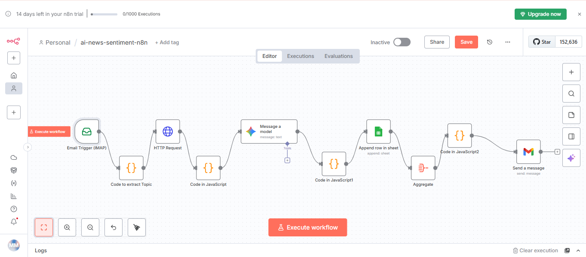

# 🧠 AI-Powered News Sentiment Automation (n8n + Gemini + Google Sheets)

This workflow automatically analyzes the sentiment of daily news articles using **n8n**, **Google Gemini**, and **Google Sheets** — triggered directly from email.

---

## 🚀 Features

✅ Automatically reads topic emails (via IMAP)  
✅ Fetches top news articles using **NewsAPI**  
✅ Performs **sentiment analysis** with **Gemini AI**  
✅ Saves results (sentiment + reason) into Google Sheets  
✅ Sends a summarized daily sentiment report via Gmail  

---

## ⚙️ Workflow Overview

**Trigger → Code → HTTP → Gemini AI → Google Sheets → Summary → Gmail**

<h2 align="center">🧭 Workflow Diagram</h2>

  

---

## 🎥 Demo Video

  <video src="./assets/demo.mp4" width="700" controls></video>

  ▶️ <a href="https://github.com/muhammadmusabyaqoob/AI-News-Sentiment-n8n/blob/main/demo.mp4?raw=true">Click here to view the video</a>

---

## 🧩 Tech Stack

- **n8n** – Workflow automation  
- **Google Gemini AI** – Sentiment analysis  
- **NewsAPI** – News data source  
- **Google Sheets API** – Data storage  
- **Gmail API** – Daily report email  
- **JavaScript (Code Nodes)**  

---

## 🧠 Key Highlights

- Extracts topic automatically from email subject line  
- Fetches top 5 related articles using NewsAPI  
- Analyzes each article’s tone → Positive / Negative / Neutral  
- Logs data and trend summaries in Google Sheets  
- Emails a summarized sentiment report daily  

---

## 📧 Example Output

**Email Subject:** `Analyze News: AI`  

**Generated Summary Example:**
> “Overall sentiment analysis shows that 3 articles were positive, 1 negative, and 1 neutral.”

---

## 🧑‍💻 Author

**Muhammad Musab**  
AI Engineer Intern @ Solutyics  
🌐 [GitHub Profile](https://github.com/muhammadmusabyaqoob)

---

## 🏷️ Tags

`n8n` `Gemini` `Google Sheets` `Automation` `AI` `Sentiment Analysis` `NewsAPI`

---

## 🌟 Badges

